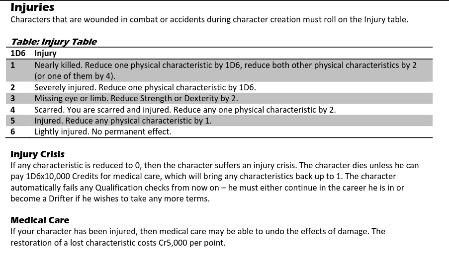

# cepheus_engine_character_generator
This JavaScript character generator for the Cepheus Engine sci-fi roleplaying game follows the character creation rules found here [available in PDF](https://www.drivethrurpg.com/product/186894/Cepheus-Engine-System-Reference-Document ).
This is based on https://github.com/pgorman/travellercharactergenerator classic Traveller character generator, I copied the files into this unlinked project so that I dont accidentally break his work. I'm learning to use Gitub through trial and error, and no formal training so expect me to make a lot of mistakes. 
~~Yes, characters _can_ die during character creation!~~

How to use this: 
1. Download this in either your phone, tablet, or desktop
2. On the [cepheus character generator](https://github.com/justinaquinoGITB/cepheus_engine_character_generator).
3. Go to the green button of Code, 
4. choose Download zip,
5. unzip or extract
6. open folder and look for Index.html
7. open index.html in a browser of choice (you can add ?history=verbose after index.html to make it detail what happned)
8. Make a Bookmark for easy access (or save to home screen on device)

How to Test (See notes 231102_00; additional changes 231103; testing pushing local changes to remote 231103)
1. Check out the effect of Changes in [https://justinaquinogitb.github.io/cepheus_engine_character_generator/index.html?history=verbose](https://justinaquinogitb.github.io/cepheus_engine_character_generator/index.html?history=verbose)
2. More importantly if you want to create the same project you can create a new repository, download and manually copy the files into that new repository (I did this because this allows me to instantly make changes without worrying about affecting pgorman's project).
3. 

(Reload the page to generate another character.)

## NEWBIE's Guide to Java Script ##

## Log ##
1. 231202 - got back into working on this. Last I remember I was supposed to make the mishap work. So there is a mishap branch. I need to make survival impossible in all the Services to properly test mishaps. Then when all the mishaps are working, we then proceed to hopefully triggering the Injury table.
2.The injury table. a table where the character can lose stats, next is the medical care and deciding how much medical debt a character will take on. So character spending 5,000cr will raise their stat back to starting level. - Prosethetic rules will need be clarified - per TL. Anyway for TL8 and up. 
 

## Origins ##
This is a branch of Pgorman's [traverllercharactergenerator](https://github.com/pgorman/travellercharactergenerator)
Thanks to a contribution from Frank Filz, a [verbose mode](https://justinaquinogitb.github.io/cechargen/index.html?history=verbose) adds behind-the-scenes character creation details.

## License (2-Clause BSD License) ##

Copyright © 2015, Paul Gorman  
All rights reserved.

Redistribution and use in source and binary forms, with or without modification, are permitted provided that the following conditions are met:

1. Redistributions of source code must retain the above copyright notice, this list of conditions and the following disclaimer.
2. Redistributions in binary form must reproduce the above copyright notice, this list of conditions and the following disclaimer in the documentation and/or other materials provided with the distribution.

THIS SOFTWARE IS PROVIDED BY THE COPYRIGHT HOLDERS AND CONTRIBUTORS "AS IS" AND ANY EXPRESS OR IMPLIED WARRANTIES, INCLUDING, BUT NOT LIMITED TO, THE IMPLIED WARRANTIES OF MERCHANTABILITY AND FITNESS FOR A PARTICULAR PURPOSE ARE DISCLAIMED. IN NO EVENT SHALL THE COPYRIGHT OWNER OR CONTRIBUTORS BE LIABLE FOR ANY DIRECT, INDIRECT, INCIDENTAL, SPECIAL, EXEMPLARY, OR CONSEQUENTIAL DAMAGES (INCLUDING, BUT NOT LIMITED TO, PROCUREMENT OF SUBSTITUTE GOODS OR SERVICES; LOSS OF USE, DATA, OR PROFITS; OR BUSINESS INTERRUPTION) HOWEVER CAUSED AND ON ANY THEORY OF LIABILITY, WHETHER IN CONTRACT, STRICT LIABILITY, OR TORT (INCLUDING NEGLIGENCE OR OTHERWISE) ARISING IN ANY WAY OUT OF THE USE OF THIS SOFTWARE, EVEN IF ADVISED OF THE POSSIBILITY OF SUCH DAMAGE.
